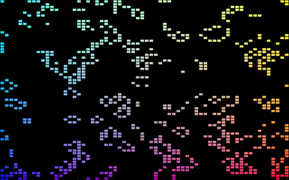

<div align="center">
    <h1>Game of Life using webgpu</h1>
    
</div>

## ✨ Description

This is the implementation of the tutorial [Your first WebGPU app](https://codelabs.developers.google.com/your-first-webgpu-app) in Rust where we're using webgpu to implement the [Conway's Game of Life](https://en.wikipedia.org/wiki/Conway%27s_Game_of_Life).

## 🔌 Setup

You need:

- [Rust](https://www.rust-lang.org/) compiler and [Cargo package manager](https://doc.rust-lang.org/cargo/)
- One of the [supported backends](https://github.com/gfx-rs/wgpu#supported-platforms) by [wgpu](https://github.com/gfx-rs/wgpu) crate.

## 🚀 Getting started

```bash
$ git clone https://github.com/pythops/golrs
$ cd golrs/
$ cargo run
```

## ⚙️ Configuration

You can specify the grid size with `size` argument (the default value is `128`)

```bash
$ cargo run -- --size <grid size: u8>
```

## License

AGPLv3
